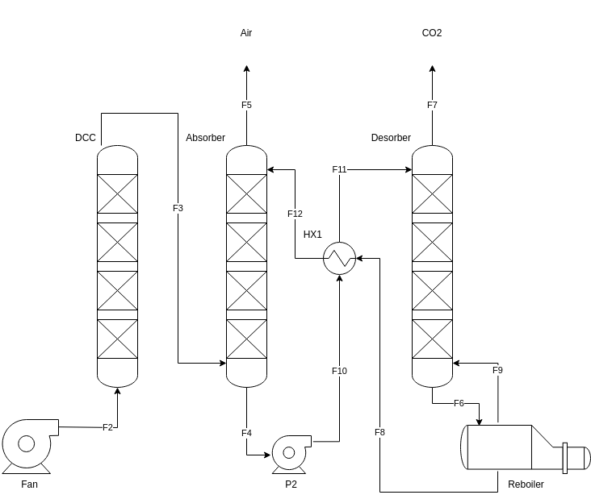
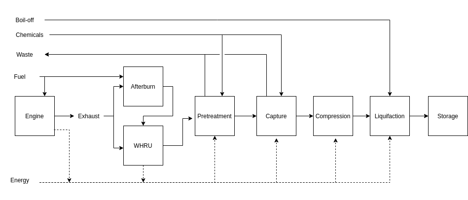
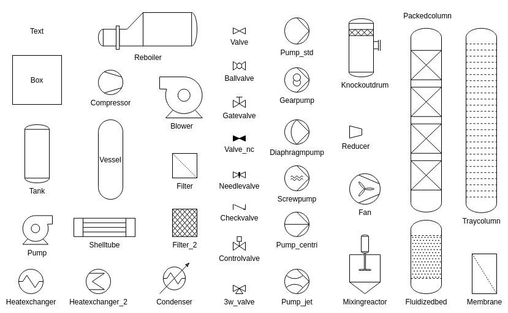
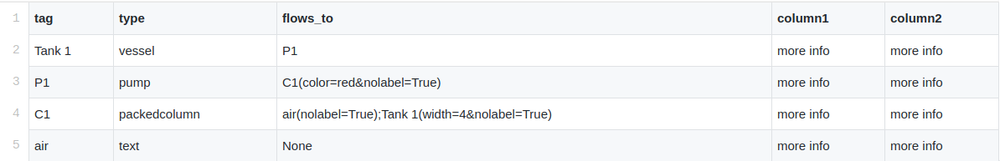
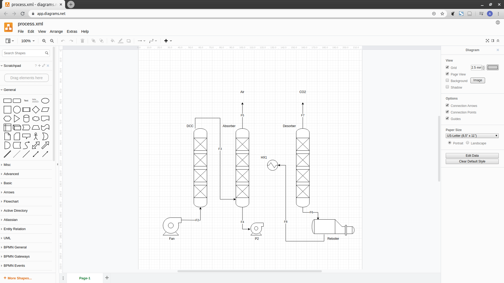
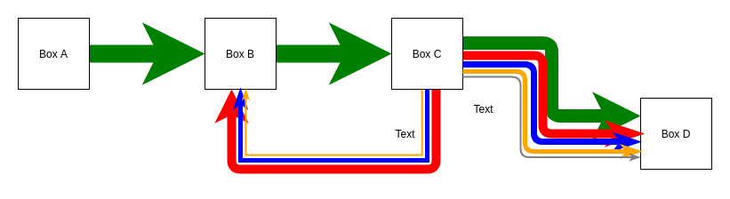

# SimplePFD
#### -a simple Python module for generating process flow diagrams (PFDs).

##### Author: Aslak Einbu April 2020.

The module generates .xml files for editing in https://app.diagrams.net.
Flow diagrams can be generated from equipment lists or by an object oriented API.
Example process flow diagram:




The above flowchart is generated from the equipment file in *./examples/mel.csv*.
Below is an example of a generic flowchart generated from *./examples/flowchart.csv*.




## Repository structure
```
.
├── examples		# Examples
├── images		# Example images
│ 
├── simplepfd.py	# Python module
├── mel.csv		# Example Main Equipment List (MEL)
├── example.xml		# Example PFD output
│ 
├── requirements.txt
└── README.md 

```
The simplePFD module consists of a single file (*simplepfd.py*) 
of ~100 lines of code + documentation and comments. 

## Getting started

### Process components

The following PFD components are currently available as part of the module:



New flowchart units can easily be implemented by adding a new line 
to the components dictionary.

(Sensors are work in progress (only one sensor symbol currently available).)


### Python object oriented API:
Import simplePFD module:
```python
import simplepfd as pfd
```

Define PFD components:
```python
tank_1 = pfd.Unit('Tank 1','tank')
tank_2 = pfd.Unit('Tank 2','tank')
pump = pfd.Unit('P-1','pump')
```

Define flows(line styles can also be edited (width, arrowhead, nolabel, dashed, color):
```python
f1 = pfd.Flow('Tank 1','P-1')
f2 = pfd.Flow('P-1', 'Tank 2')
```

Define sensors and connectors:
```python
t1 = pfd.Sensor('TT-1','TT','01')
t2 = pfd.Sensor('TT-2','TT','02')
conn_1 = pfd.Connector('TT-1','P-1')
```

Define PFD components and write XML PFD:
```python
object_component = [tank1, tank2, pump, f1, f2, t1, t2, conn_1]
pfd.write_pfd("example.xml", object_component)
```

### PFD from equiment list (MEL):

Define PFD in a MEL .csv file.

CSV headers applied:
- tag - unit or flow tag name
- type - type of component (units are component dict keys)
- flows_to - tag names as sources for outgoing unit flows ('None' if no outgoing flows.)
- MEL can alos contain any other extra columns - these will not affect PFD rendering

CSV format:
- ',' as column separation
- ';' as separation of tag flows in flows_to column
- Flow styles inside '()' separated by '&'


*mel.csv*:


In Ascii:
```
tag,type,flows_to,column1,column2
Tank 1,vessel,P1,more info, more info
P1,pump,C1(color=red&nolabel=True),more info,more info
C1,packedcolumn,air(nolabel=True);Tank 1(width=4&nolabel=True),more info, more info
air,text,None,more info, more info
```

Define PFD components and write .xml file:

```python
mel_components = pfd.components_from_mel("mel.csv")
pfd.write_pfd("example.xml", mel_components)
```

### Editor
Generated .xml PFD files can be edited in https://app.diagrams.net.
After the first-time generation of a diagram, the components needs manual re-arrangement.
Export the edited .xml file for saving your changes. 
New simplepfd operations on the file updates for changes in components and flows but keeps your saved layout.




### Sankey diagrams

By manipulating line width of the different flows, simple Sankey diagrams can also be produced.



Example flowchart generated from ./examples/sankey.py.


## Feature requests / TODO-list

- Implementing sensors and connectors generated from MEL
- More sensor types
